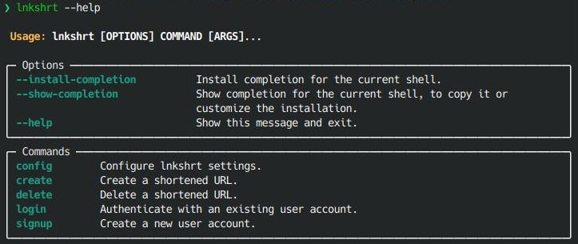

# lnkshrt-cli

`lnkshrt-cli` is a command-line application that allows you to easily generate shortened URLs, authenticate with your lnkshrt account, delete links, and perform other actions from the command line. It provides a convenient and efficient way of interfacing with the [`lnkshrt`](https://github.com/vivekashok1221/lnkshrt) link shortening API hosted at [lnkshrt.xyz](https://lnkshrt.xyz)

# Table of Contents
- [Features](#features)
- [Installation](#installation)
- [Quick Start](#quick-start)
- [Usage](#usage)
- [Development](#development)
- [License](#license)


# Features

- Generate shortened URLs for quick and easy sharing.
- Delete existing links when they are no longer needed.
- Easily authenticate with the API.
- Generate QR codes for the shortened URLs.

By default, the CLI app interacts with the `lnkshrt` API instance hosted at [lnkshrt.xyz](https://lnkshrt.xyz). However, if you prefer to use a different `lnkshrt` API instance, you have the flexibility to set a custom instance using the `lnkshrt config --instance-url` command. This is particularly useful for [development purposes](#if-you-want-to-use-a-locally-running-instance-of-the-api).

For more information about the `lnkshrt` API itself, see the [API repository](https://github.com/vivekashok1221/lnkshrt).

# Installation

You can install `lnkshrt-cli` using pip or [pipx](https://pypa.github.io/pipx/installation/) (recommended):

## Installation with pip
```shell
pip install lnkshrt
```

## Installation with pipx (recommended)
Alternatively, if you prefer to install the package in an isolated environment, use pipx:
```shell
pipx install lnkshrt
```

# Quick Start

1. Create an account:
    ```shell
    lnkshrt create --username <your_username> --email <valid_email>
    ```


2. Once you have created an account, you can authenticate with lnkshrt-cli using the following command:

    ```shell
    lnkshrt login --username <your_username>
    ```
    This will prompt you to enter your lnkshrt account credentials and generate an authentication token for API access. The token will be saved and used for subsequent API requests.

3. To generate a shortened URL:

    ```shell
    lnkshrt create <url you want to shorten>
    ```

4. To delete a previously created link, you can use the lnkshrt delete command followed by the shortened URL:

    ```shell
    lnkshrt delete <short_url>
    ```
    Replace `<short_url>` with the shortened URL you intend to delete.

For more information on available commands and options, you can use the built-in help:

```shell
lnkshrt --help
```

# Usage

```console
$ lnkshrt [OPTIONS] COMMAND [ARGS]...
```

**Options**:

* `--install-completion`: Install completion for the current shell.
* `--show-completion`: Show completion for the current shell, to copy it or customize the installation.
* `--help`: Show this message and exit.

**Commands**:

* [`config`](#lnkshrt-config): Configure lnkshrt settings.
* [`create`](#lnkshrt-create): Create a shortened URL.
* [`delete`](#lnkshrt-delete): Delete a shortened URL.
* [`login`](#lnkshrt-login): Authenticate with an existing user account.
* [`signup`](#lnkshrt-signup): Create a new user account.

## lnkshrt config

Configure lnkshrt settings.

This command provides a convenient way to set and modify lnkshrt settings.
The settings are stored in a configuration file named `settings.toml`.
This command is the recommended way of modifying this file.

**Usage**:

```console
$ lnkshrt config [OPTIONS]
```

**Options**:

* `--instance-url TEXT`: The URL of the instance to use for shortening links.If invoked without any value, the instance URL will be reset to the default.
* `--token TEXT`: Set the authentication token to be used for API access.
* `--help`: Show this message and exit.

## lnkshrt create

Create a shortened URL.

**Usage**:

```console
$ lnkshrt create [OPTIONS] URL
```

**Arguments**:

* `URL`: The original URL to be shortened.  [required]

**Options**:

* `--custom-path TEXT`: Specify a custom path for the shortened URL.
* `--generate-qr-code TEXT`: If provided, generate a QR code for the shortened URLThe generated QR code image will be saved to the specified location.
* `--help`: Show this message and exit.

## lnkshrt delete

Delete a shortened URL.

**Usage**:

```console
$ lnkshrt delete [OPTIONS] URL
```

**Arguments**:

* `URL`: The original URL to be shortened.  [required]

**Options**:

* `--help`: Show this message and exit.

## lnkshrt login

Authenticate with an existing user account.

Upon successful authentication, an authentication token will be
generated and stored for future API requests.
Accounts can be created using the `lnkshrt signup` command.

**Usage**:

```console
$ lnkshrt login [OPTIONS]
```

**Options**:

* `--username TEXT`: [required]
* `--password TEXT`: Your password. If not provided, you will be prompted to enter it. [required]
* `--help`: Show this message and exit.

## lnkshrt signup

Create a new user account.

**Usage**:

```console
$ lnkshrt signup [OPTIONS]
```

**Options**:

* `--username TEXT`: [required]
* `--email TEXT`: [required]
* `--password TEXT`: Your password. If not provided, you will be prompted to enter it.  [required]
* `--help`: Show this message and exit.

# Development

- ### Clone the repository and navigate to the project directory:
    ```shell
    git clone https://github.com/vivekashok1221/lnkshrt-cli.git

    cd lnkshrt-cli
    ```
- ### Set up poetry env

   Assuming you have [poetry installed](https://python-poetry.org/docs/#installation), install the dependencies by running:
   ```shell
   poetry install
   ```

   To activate the poetry venv:
   ```shell
   poetry shell
   ```

- ### Set Up Pre-commit Hooks
   ```shell
   poetry run task precommit
   ```
   `pre-commit`  helps ensure code quality and consistency by automatically running various checks and formatting tools on your code before each commit.

- ### Linting

   To manually run the linting checks:
   ```shell
   poetry run task lint
   ```

- ### If you want to use a locally running instance of the API:
    1. Set up `lnkshrt` API by following the guide in the ["Getting Started"](https://github.com/vivekashok1221/lnkshrt#getting-started) section of the API repository.

   2. Set the instance URL to http://0.0.0.0:8000 by running the following command:
        ```shell
        lnkshrt config --instance-url http://0.0.0.0:8000
        ```
# License

This project is licensed under the MIT License.
